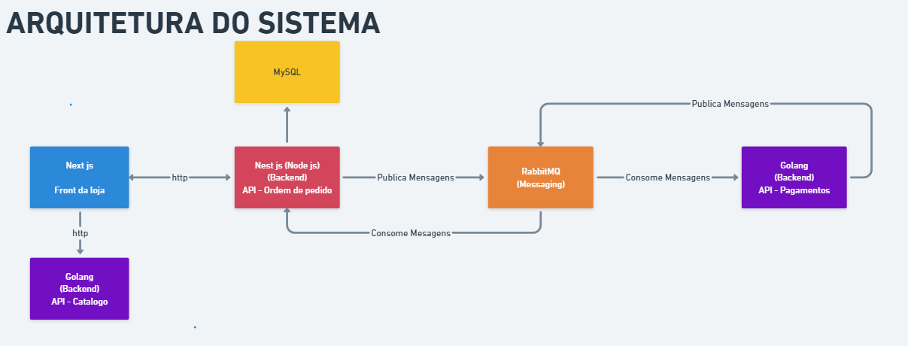

# Ecommerce com backend de alta performance

Este é um projeto com todo processo de ecommerce, usando as melhores praticas para um backend escalavel

<h1>Tecnologias utilizadas:</h1> 
<ul>
<li>Go</li>
<li>NestJS</li>
<li>RabbitMQ</li>
<li>TypeORM, MySQL</li>
<li>Nextjs</li>
</ul>

## Ordem de execução dos projetos

1. goapi
2. nestjs-api
3. payment-service
4. nextjs-frontend
